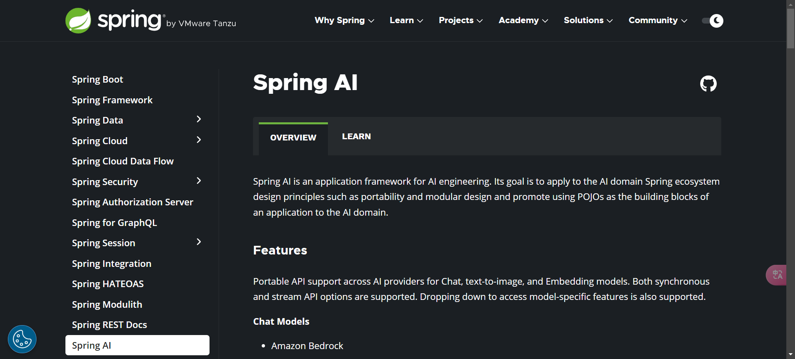
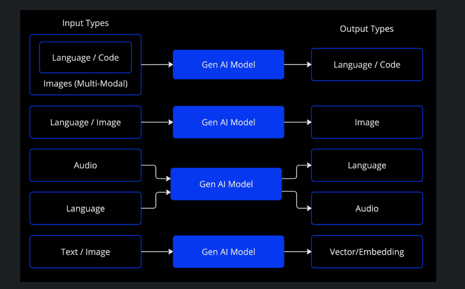
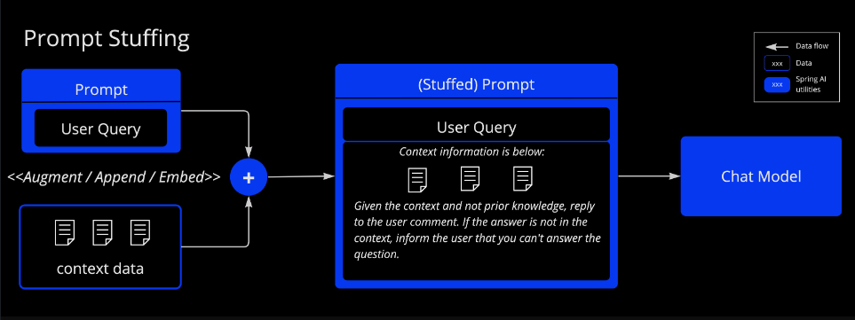
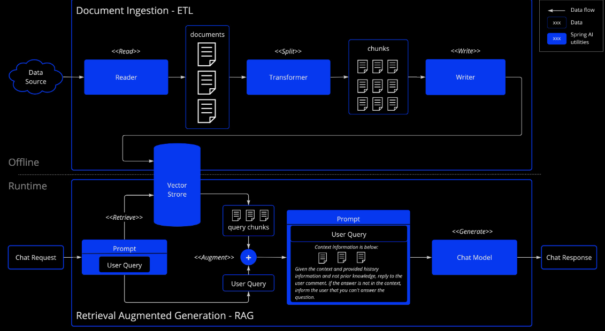
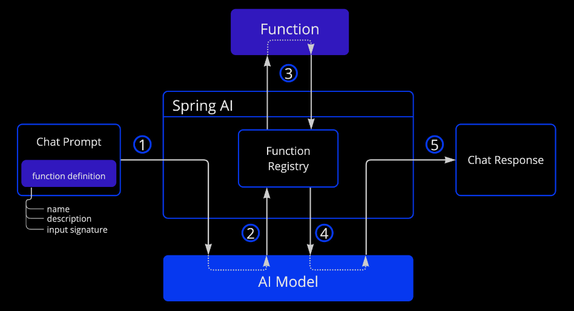

# Spring AI 概述

https://spring.io/projects/spring-ai



Spring AI 是一个面向 AI 工程的应用框架。其目标是将 Spring 生态系统设计原则，如可移植性和模块化设计，应用于 AI 领域，并推广使用 POJOs 作为应用程序的构建块。

Spring AI 项目旨在简化开发集成人工智能功能的应用程序，避免不必要的复杂性。该项目汲取了 LangChain 和 LlamaIndex 等知名 Python 项目的灵感，但 Spring AI 并非这些项目的直接移植。该项目成立之初便坚信，下一代生成式 AI 应用不仅限于 Python 开发者，而是将普及到众多编程语言中。

在本质意义上，Spring AI 解决了人工智能集成的根本挑战： `Connecting your enterprise Data and APIs with the AI Models` 。

# 支持的功能

Spring AI 提供了作为开发 AI 应用基础的抽象。这些抽象具有多种实现方式，使得组件替换变得简单，代码更改最小化。Spring AI 提供以下功能：

- 支持所有主流模型提供商，包括 Anthropic、Azure OpenAI、Amazon Bedrock、Google、HuggingFace、Mistral、Oracle、Stability AI、Watson、Minimax、Moonshot、QianFan、ZhiPu AI、PostgresML 和 ONNX Transformers。
- 支持的模式类型包括聊天、嵌入、文本到图像、音频转录、文本到语音和内容审核。也支持多模态模型。
- Spring Boot 自动配置所有模型，简化设置和集成。提供跨 AI 提供商的通用 API，支持所有模型。同时支持同步和流式 API 选项。还支持降级以访问特定模型的特性。
- AOT（即时编译）原生图像支持，以提升性能和缩短启动时间。
- 增强利用 Spring 生态系统功能的可观察性，为 AI 相关操作提供洞察。Spring AI 为 ChatClient、ChatModel、EmbeddingModel、ImageModel 和 VectorStore 等核心组件提供指标和跟踪功能。
- Structured Output to enable mapping of AI Model output to POJOs.
  结构化输出，以实现将 AI 模型输出映射到 POJOs。功能(Function)调用支持。
- 支持所有主流向量数据库提供商，包括 Apache Cassandra、Azure Vector Search、Chroma、Milvus、MongoDB Atlas、Neo4j、Oracle、PostgreSQL/PGVector、PineCone、Qdrant、Redis 和 Weaviate。
- 跨向量存储提供商的便携式 API，包括一个新颖的、可移植的类似 SQL 的元数据过滤 API。
- 数据工程向向量存储加载数据的 ETL 框架。
- 人工智能应用评估测试支持，允许对生成内容进行评估，以防止出现幻觉式回答。这包括使用 AI 模型进行自我评估的能力，并具有选择最适合评估目的的模型的灵活性。
- Spring Boot 自动配置，用于建立连接到通过 Testcontainers 或 Docker Compose 运行的模型服务或向量存储。

# AI Concepts 有关 AI 相关的概念

> [!TIP]
>
> **本节介绍了 Spring AI 所使用的核心概念。我们建议您仔细阅读，以理解 Spring AI 实现背后的理念。**

##  Models 模型

人工智能模型是设计用于处理和生成信息的算法，通常模仿人类的认知功能。通过从大量数据集中学习模式和洞察，这些模型可以做出预测，生成文本、图像或其他输出，从而增强各个行业中的应用。

有许多不同类型的 AI 模型，每种都适用于特定的用例。虽然 ChatGPT 及其生成式 AI 功能通过文本输入和输出吸引了用户，但许多模型和公司提供了多样化的输入和输出。在 ChatGPT 之前，许多人被文本到图像生成模型如 Midjourney 和 Stable Diffusion 所吸引。

以下表格根据模型的输入和输出类型对它们进行分类：



Spring AI 目前支持处理语言、图像和音频输入输出的模型。前表中最后一行，接受文本输入并输出数字，通常被称为文本嵌入，代表了 AI 模型内部使用的数据结构。Spring AI 支持嵌入功能，以实现更高级的应用场景。

GPT 这类模型之所以与众不同，就在于它们的预训练特性，正如“GPT”中的“P”所暗示的——Chat Generative Pre-trained Transformer。这种预训练功能将 AI 转变成了一个通用的开发者工具，无需深厚的机器学习或模型训练背景。

## Prompts 提示

提示语是引导 AI 模型产生特定输出的语言型输入的基础。对于熟悉 ChatGPT 的人来说，提示语可能只是输入到对话框中并发送到 API 的文本。然而，它所包含的内容远不止于此。在许多 AI 模型中，提示语的文本并不仅仅是一个简单的字符串。ChatGPT 的 API 在提示中包含多个文本输入，每个文本输入都被分配了一个角色。例如:

- 有系统角色，它告诉模型如何表现并设定交互的上下文
- 还有用户角色，通常是用户的输入

编写有效的提示既是艺术也是科学。ChatGPT 被设计用于人类对话。这与使用类似 SQL 的“提问”方式大相径庭。与 AI 模型交流需要像与人交谈一样。这种交互方式的重要性不言而喻，以至于“提示工程”已经成为一门独立的学科。围绕提高提示效果，涌现出大量技术。在精心设计提示上投入时间，可以显著提升输出结果的质量。

分享提示已成为一种社区实践，关于这一主题的学术研究也在积极进行。例如，为了说明创建一个有效的提示可能多么反直觉（例如，与 SQL 相比），一篇 [最近的研究论文](https://arxiv.org/abs/2205.11916) 发现，最有效的提示之一是以“深呼吸，一步一步来”这句话开始的。这应该足以说明语言的重要性。我们尚未完全理解如何最大限度地利用之前的技术迭代，如 ChatGPT 3.5，更不用说正在开发的新版本了。

### Prompt Templates 模板提示

创建有效的提示需要建立请求的上下文，并用针对用户输入的具体值替换请求的部分。此过程使用传统的基于文本的模板引擎进行提示创建和管理。Spring AI 为此目的采用了开源库 [StringTemplate](https://www.stringtemplate.org/)。例如，考虑一个简单的提示模板：

```java
Tell me a {adjective} joke about {content}.
```

在 Spring AI 中，提示模板可以类比为 Spring MVC 架构中的“视图”。一个模型对象，通常是一个`java.util.Map`，用于填充模板中的占位符。"渲染"后的字符串成为提供给 AI 模型的提示内容。该模型收到的提示的具体数据格式存在很大差异。最初，提示以简单的字符串形式开始，后来逐渐演变为包含多个消息，其中每个消息中的每个字符串都代表模型的一个特定角色。

## Embeddings 嵌入

嵌入是文本、图像或视频的数值表示，它捕捉输入之间的相互关系。嵌入通过将文本、图像和视频转换为浮点数数组，即向量，来实现。这些向量旨在捕捉文本、图像和视频的意义。向量的长度称为向量的维度。通过计算两个文本的向量表示之间的数值距离，应用程序可以确定用于生成嵌入向量的对象之间的相似度。


> [!TIP]
>
> **作为一名探索人工智能的 Java 开发者，理解这些向量表示背后的复杂数学理论或具体实现并非必要。对它们在人工智能系统中的作用和功能有一个基本的了解就足够了，尤其是在将人工智能功能集成到您的应用程序中时。**

嵌入技术在实际应用中尤为重要，如检索增强生成（RAG）模式。**它们可以将数据表示为语义空间中的点，类似于欧几里得几何中的二维空间，但维度更高。这意味着，就像在欧几里得几何中，平面上的点可以根据它们的坐标距离彼此接近或远离一样，在语义空间中，点的邻近性反映了它们在意义上的相似性**。关于相似主题的句子在这个多维空间中位置更近，就像在图表上彼此靠近的点一样。这种邻近性有助于文本分类、语义搜索甚至产品推荐等任务，因为它允许 AI 根据它们在这个扩展的语义景观中的“位置”来区分和分组相关概念**。您可以将这个语义空间想象成一个向量。**

## Tokens

token 是人工智能模型运作的基础构件。在输入时，模型将词语转换为 token ；在输出时，它们将令牌转换回 token 。在英语中，一个token 大约对应 75%的单词。以莎士比亚的全部作品为例，总共有约 90 万单词，翻译成 token 大约是 120 万个。


> [!NOTE]
>
> **或许更重要的是，token 就是金钱。在托管 AI 模型的环境中，您的费用是根据使用的 Token 数量来确定的。输入和输出都会计入总的 Token 数量。**

**同样，模型受到令牌限制，这限制了单次 API 调用中处理的文本量。这个阈值通常被称为“上下文窗口”。模型不会处理超出此限制的任何文本。**例如，ChatGPT3 的令牌限制为 4K，而 GPT4 提供了多种选项，如 8K、16K 和 32K。Anthropic 的 Claude AI 模型具有 100K 令牌限制，而 Meta 最近的研究成果推出了一种 1M 令牌限制的模型。

总结使用 GPT4 对莎士比亚的著作进行收集时，您需要制定软件工程策略来切割数据，并在模型上下文窗口限制内呈现数据。Spring AI 项目可以帮助您完成这项任务。

##  Structured Output 结构化输出

AI 模型的输出传统上以`java.lang.String`的形式出现，即使你要求回复以 JSON 格式。它可能是一个正确的 JSON，但它不是一个 JSON 数据结构。它只是一个字符串。此外，将“JSON”作为提示的一部分并不完全准确。这种复杂性导致了专门领域的出现，该领域涉及创建提示以产生预期输出，然后将生成的简单字符串转换为可用的数据结构，以便进行应用集成。


结构化输出转换使用精心制作的提示，通常需要与模型进行多次交互才能达到所需的格式。

## Bringing Your Data & APIs to the AI Model 将数据与 API 引入 AI 模型

> [!TIP]
>
> **请注意，GPT 3.5/4.0 的数据集仅扩展到 2021 年 9 月。因此，该模型表示它不知道那些需要超出此日期的知识来回答的问题。有趣的是，这个数据集大约有 650 GB。那么我们该如何为 AI 模型配备它未接受过训练的信息？**

三种技术可用于定制 AI 模型以纳入您的数据：

- **微调**：这是一种传统的机器学习技术，涉及调整模型并改变其内部权重。然而，对于像 GPT 这样的大型模型来说，这是一个对机器学习专家来说具有挑战性的过程，并且资源消耗极大。此外，一些模型可能不提供此选项。

- **提示填充**：一种更实用的替代方案是将数据嵌入到提供给模型的提示中。鉴于模型的令牌限制，需要采用技术来在模型上下文中呈现相关数据。这种方法通常被称为“提示填充”。Spring AI 库可以帮助您实现基于“提示填充”技术的解决方案，也称为 [检索增强生成（RAG）](https://docs.spring.io/spring-ai/reference/concepts.html#concept-rag)。

  

- **[函数调用](https://docs.spring.io/spring-ai/reference/concepts.html#concept-fc)**：这项技术允许注册自定义的用户函数，将大型语言模型与外部系统的 API 连接起来。Spring AI 极大地简化了您需要编写的支持 **[函数调用](https://docs.spring.io/spring-ai/reference/api/functions.html)** 的代码。

### RAG 检索增强生成

**一种名为检索增强生成（RAG）的技术应运而生，旨在解决将相关数据纳入提示以实现 AI 模型准确响应的挑战。该方法采用批处理风格的编程模型，其中作业从您的文档中读取非结构化数据，对其进行转换，然后将数据写入向量数据库。从宏观角度来看，这是一个 ETL（提取、转换和加载）管道。向量数据库用于 RAG 技术中的检索部分。**

**作为将非结构化数据加载到向量数据库的一部分，最重要的转换之一是将原始文档拆分成更小的部分。将原始文档拆分成更小部分的程序包含两个重要步骤：**

1. **文档应分段处理，同时保留内容的语义边界。例如，对于包含段落和表格的文档，应避免在段落或表格的中间分割文档。对于代码，应避免在方法实现过程中分割代码。**
2. **将文档的部分进一步拆分，使其大小仅为 AI 模型令牌限制的一小部分。**

下一阶段在 RAG 中是处理用户输入。当用户的提问需要由 AI 模型回答时，问题以及所有“相似”的文档片段将被放入发送给 AI 模型的提示中。这就是使用向量数据库的原因。它在查找相似内容方面非常出色。



- ETL 管道提供了有关如何编排从数据源提取数据并将其存储在结构化向量存储中的流程的更多信息，确保数据在传递给 AI 模型时处于最佳检索格式。
- [ChatClient - RAG](https://docs.spring.io/spring-ai/reference/api/chatclient.html#_retrieval_augmented_generation) 解释了如何使用`问答顾问（QuestionAnswerAdvisor）`来在您的应用程序中启用 RAG 功能。

### Function Calling 函数调用

大型语言模型（LLMs）在训练后会被冻结，导致知识过时，并且无法访问或修改外部数据。[函数调用](https://docs.spring.io/spring-ai/reference/api/functions.html) 机制解决了这些问题。它允许您注册自己的函数，将大型语言模型与外部系统的 API 连接起来。这些系统可以为 LLMs 提供实时数据，并代表它们执行数据处理操作。

Spring AI 极大地简化了您需要编写的支持函数调用的代码。它为您处理函数调用的对话。您可以将您的函数作为`@Bean`提供，然后在您的提示选项中提供该函数的 bean 名称以激活该函数。此外，您可以在单个提示中定义和引用多个函数。



1. 执行发送聊天请求的功能定义信息。后者提供`名称`、`描述`（例如解释模型何时应调用该函数）以及`输入参数`（例如函数的输入参数模式）。
2. 当模型决定调用该函数时，它将使用输入参数调用该函数，并将输出返回给模型。
3. Spring AI 为您处理这次对话。它将函数调用调度到相应的函数，并将结果返回给模型。
4. 该模型可以执行多个函数调用，以获取所需的所有信息。
5. 一旦获取所需的所有信息，模型将生成响应。

请参考 [函数调用](https://docs.spring.io/spring-ai/reference/api/functions.html) 文档以获取有关如何使用此功能与不同 AI 模型配合使用的更多信息。

## 评估人工智能的回应

有效评估 AI 系统对用户请求的输出，对于确保最终应用的准确性和实用性至关重要。一些新兴技术使得直接利用预训练模型本身进行评估成为可能。**这个评估过程包括分析生成的回复是否与用户的意图和查询的上下文相符。使用相关性、连贯性和事实准确性等指标来衡量 AI 生成回复的质量。**

> [!NOTE]
>
> **一种方法是将用户的请求和 AI 模型的响应同时呈现给模型，并询问该响应是否与提供的数据相符。此外，利用向量数据库中存储的信息作为辅助数据，可以增强评估过程，有助于确定响应的相关性。**

Spring AI 项目提供了一个`评估器`API，目前它提供了评估模型响应的基本策略。请参考 [评估测试](https://docs.spring.io/spring-ai/reference/api/testing.html) 文档以获取更多信息。

