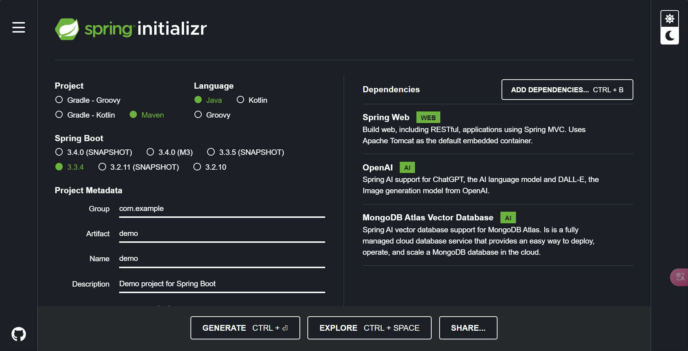
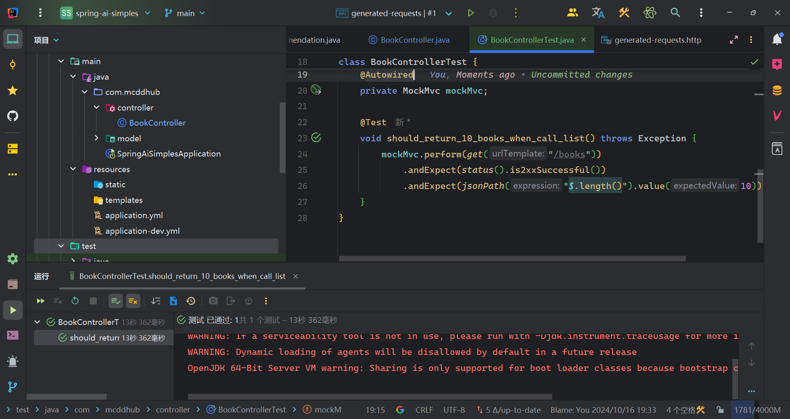
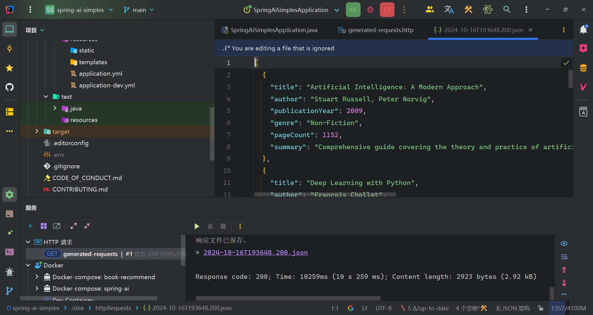

# Spring AI quickstart

本节为您提供了如何开始使用 Spring AI 的入门指南。

>[!NOTE]
> Spring AI 支持 Spring Boot 3.2.x 和 3.3.x 版本

我们可以通过 `Spring Initializer` 和 `手动构建` 的方式创建 Spring AI 项目,请按照以下各部分的需求步骤进行操作。

# Spring Initializr (推荐)

前往 https://start.spring.io/ 选择您想在新的应用程序中使用的 AI 模型和向量存储。



- `Spring Web`: 使用 Spring MVC 构建 Web，包括 RESTful 应用程序。默认使用 Apache Tomcat 作为嵌入式容器。
- `Open AI`: 提供 ChatGPT 的 AI 语言模型和 DALL-E 图像生成模型的支持
- `MongoDB Atlas Vector Database`: Spring AI 向量数据库支持 MongoDB Atlas。它是完全托管的云数据库服务，提供了一种简单的方式来部署、操作和扩展云中的 MongoDB 数据库。

> [!NOTE]
>
> 也可以添加 
>
> - `Docker Compose Support`: 提供 Docker Compose 支持，增强开发体验。
> - `Testcontainers`: 提供轻量级的、可丢弃的常见数据库、Selenium 网络浏览器或其他可在 Docker 容器中运行的实例。
>
> 便于开发

# 手动构建

如果您希望手动添加依赖片段，请按照以下章节中的说明操作。

## 添加里程碑和快照仓库

要使用里程碑和快照版本，您需要在构建文件中添加对 Spring 里程碑和/或快照仓库的引用。

- maven

  ```xml
    <repositories>
      <repository>
        <id>spring-milestones</id>
        <name>Spring Milestones</name>
        <url>https://repo.spring.io/milestone</url>
        <snapshots>
          <enabled>false</enabled>
        </snapshots>
      </repository>
      <repository>
        <id>spring-snapshots</id>
        <name>Spring Snapshots</name>
        <url>https://repo.spring.io/snapshot</url>
        <releases>
          <enabled>false</enabled>
        </releases>
      </repository>
    </repositories>
  ```

- gradle

    ```groovy
    repositories {
      mavenCentral()
      maven { url 'https://repo.spring.io/milestone' }
      maven { url 'https://repo.spring.io/snapshot' }
    }
    ```

## 依赖管理

Spring AI 物料清单（BOM）声明了 Spring AI 给定版本所使用的所有依赖项的推荐版本。使用您应用程序的构建脚本中的 BOM 可以避免您自己指定和维护依赖项版本的需求。相反，您所使用的 BOM 版本决定了所使用的依赖项版本。它还确保您默认使用受支持和经过测试的依赖项版本，除非您选择覆盖它们。

- 如果您是 Maven 用户，您可以通过在 pom.xml 文件中添加以下内容来使用 BOM

  ```xml
  <dependencyManagement>
      <dependencies>
          <dependency>
              <groupId>org.springframework.ai</groupId>
              <artifactId>spring-ai-bom</artifactId>
              <version>1.0.0-SNAPSHOT</version>
              <type>pom</type>
              <scope>import</scope>
          </dependency>
      </dependencies>
  </dependencyManagement>
  ```

- Gradle 用户可以通过利用 Gradle（5.0+）对 Maven BOM 声明依赖约束的原生支持来使用 Spring AI BOM。这是通过在 Gradle 构建脚本中依赖项部分添加一个'platform'依赖处理方法来实现的。如下面的代码片段所示，这之后可以跟随着对您希望使用的 Spring AI 模块（例如 spring-ai-openai）的启动依赖项的无版本声明。

  ```groovy
  dependencies {
    implementation platform("org.springframework.ai:spring-ai-bom:1.0.0-SNAPSHOT")
    // Replace the following with the starter dependencies of specific modules you wish to use
    implementation 'org.springframework.ai:spring-ai-openai'
  }
  ```

## 添加特定组件的依赖项

  以下文档的每个部分都展示了您需要在项目构建系统中添加哪些依赖项。

- [Chat Models 聊天模型](https://docs.spring.io/spring-ai/reference/api/chatmodel.html)
- [Embeddings Models 嵌入模型](https://docs.spring.io/spring-ai/reference/api/embeddings.html)
- [Image Generation Models 图像生成模型](https://docs.spring.io/spring-ai/reference/api/imageclient.html)
- [Transcription Models 转录模型](https://docs.spring.io/spring-ai/reference/api/audio/transcriptions.html)
- [Text-To-Speech (TTS) Models 文本到语音（TTS）模型](https://docs.spring.io/spring-ai/reference/api/audio/speech.html)
- [Vector Databases 向量数据库](https://docs.spring.io/spring-ai/reference/api/vectordbs.html)

# demo

该案例提供了一个简易的案例用于快速体验 SpringAI ,其功能为通过调用 `http://localhost:8080/books` 然后生成符合条件 (数量为 10 且返回结果与实体相同而非 json 字符串) 的 `BookRecommendation`

1. 引入依赖

   ```xml
   <?xml version="1.0" encoding="UTF-8"?>
   <project xmlns="http://maven.apache.org/POM/4.0.0" xmlns:xsi="http://www.w3.org/2001/XMLSchema-instance"
            xsi:schemaLocation="http://maven.apache.org/POM/4.0.0 https://maven.apache.org/xsd/maven-4.0.0.xsd">
       <modelVersion>4.0.0</modelVersion>
       <parent>
           <groupId>org.springframework.boot</groupId>
           <artifactId>spring-boot-starter-parent</artifactId>
           <version>3.3.4</version>
           <relativePath/> <!-- lookup parent from repository -->
       </parent>
       <groupId>com.mcddhub</groupId>
       <artifactId>spring-ai-simples</artifactId>
       <version>0.0.1-SNAPSHOT</version>
       <name>spring-ai-simples</name>
       <description>spring-ai-simples</description>
   
       <properties>
           <java.version>21</java.version>
           <spring-ai.version>1.0.0-M3</spring-ai.version>
       </properties>
       <dependencies>
           <dependency>
               <groupId>org.springframework.boot</groupId>
               <artifactId>spring-boot-starter-web</artifactId>
           </dependency>
           <dependency>
               <groupId>org.springframework.ai</groupId>
               <artifactId>spring-ai-openai-spring-boot-starter</artifactId>
           </dependency>
   
           <dependency>
               <groupId>org.springframework.boot</groupId>
               <artifactId>spring-boot-starter-test</artifactId>
               <scope>test</scope>
           </dependency>
       </dependencies>
       <dependencyManagement>
           <dependencies>
               <dependency>
                   <groupId>org.springframework.ai</groupId>
                   <artifactId>spring-ai-bom</artifactId>
                   <version>${spring-ai.version}</version>
                   <type>pom</type>
                   <scope>import</scope>
               </dependency>
           </dependencies>
       </dependencyManagement>
   
       <build>
           <plugins>
               <plugin>
                   <groupId>org.springframework.boot</groupId>
                   <artifactId>spring-boot-maven-plugin</artifactId>
               </plugin>
           </plugins>
       </build>
       <repositories>
           <repository>
               <id>spring-milestones</id>
               <name>Spring Milestones</name>
               <url>https://repo.spring.io/milestone</url>
               <snapshots>
                   <enabled>false</enabled>
               </snapshots>
           </repository>
       </repositories>
   
   </project>
   
   ```

2. 配置

   ```yml
   spring:
     ai:
       openai:
         api-key: ${EPHONE_API_KEY}
         base-url: ${EPHONE_API_URL}
   ```

3. 编码

   ```java
   public record BookRecommendation(
           String title,
           String author,
           int publicationYear,
           String genre,
           int pageCount,
           String summary
   ) {
   }
   ```

   ```java
   @RestController
   @RequestMapping("/books")
   public class BookController {
       private final ChatClient chatClient;
   
       public BookController(ChatClient.Builder builder) {
           this.chatClient = builder.build();
       }
   
       @GetMapping
       public List<BookRecommendation> list() {
           return chatClient.prompt()
               .user("Generate 10 book recommendation for a book on AI and coding. Please limit the summary to 100 words.")
               .call()
               .entity(new ParameterizedTypeReference<>() {
               });
       }
   }
   ```

4. 测试

   ```java
   @AutoConfigureMockMvc
   @ExtendWith(SpringExtension.class)
   @SpringBootTest
   class BookControllerTest {
       @Autowired
       private MockMvc mockMvc;
   
       @Test
       void should_return_10_books_when_call_list() throws Exception {
           mockMvc.perform(get("/books"))
               .andExpect(status().is2xxSuccessful())
               .andExpect(jsonPath("$.length()").value(10));
       }
   }
   ```

   ```http
   GET http://localhost:8080/books
   ```




